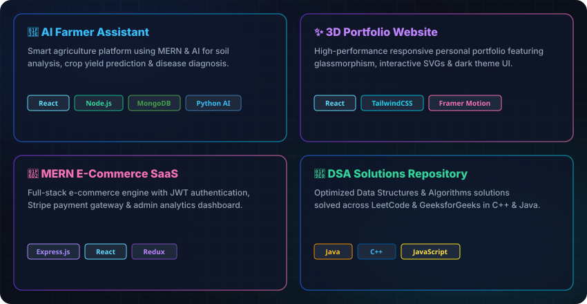

<div align="center">

  <!-- BANNER SVG -->
  

  <br/><br/>

  <!-- ANIMATED TYPING TERMINAL (FULL STACK MERN DEVELOPER, EDITOR, STUDENT) -->
  

  <br/><br/>

  <!-- CLICKABLE SOCIAL MEDIA BADGES -->
  <p align="center">
    <a href="https://www.linkedin.com/in/mahendra-naidu-meesala" target="_blank">
      
    </a>
    &nbsp;
    <a href="https://www.instagram.com/mahendra_naidu" target="_blank">
      
    </a>
    &nbsp;
    <a href="https://www.youtube.com/@mahendra-naidu" target="_blank">
      
    </a>
    &nbsp;
    <a href="mailto:mahendra.meesala@example.com" target="_blank">
      
    </a>
    &nbsp;
    <a href="https://leetcode.com/u/MAHENDRA-NAIDU" target="_blank">
      
    </a>
    &nbsp;
    <a href="https://www.geeksforgeeks.org/user/MAHENDRA-NAIDU" target="_blank">
      
    </a>
  </p>

  <br/>

  <!-- RED GRADIENT DIVIDER LINE -->
  

  <br/><br/>

</div>

<!-- ABOUT ME SECTION -->
<h2 align="left">📊 About Me</h2>

<table width="100%">
<tr>
<td width="55%" valign="top">

```javascript
const mahendra = {
    pronouns: "He/Him",
    location: "India 🇮🇳",
    education: "B.Tech CSE",
    roles: ["Full Stack MERN Developer", "Editor", "Student"],
    currentFocus: "MERN Stack & AI Projects 🚀",
    learning: ["MERN Stack", "System Design", "DSA"],
    interests: ["Problem Solving", "Web Development", "Video Editing"],
    motto: "Bugs in my head never make me sleep ^_^",

    lifeLoop: function() {
        while(alive) {
            eat();
            code();
            solve();
            repeat();
        }
    }
};
```

</td>
<td width="45%" valign="center" align="center">
  <!-- ANIMATED VECTOR ILLUSTRATION -->
  
</td>
</tr>
</table>

<br/>

<div align="center">
  <!-- RED GRADIENT DIVIDER LINE -->
  
  <br/><br/>

  <!-- TECH ARSENAL SECTION -->
  <h2>&lt;/&gt; Tech Arsenal</h2>
  <br/>

  <h3>🎨 Frontend Magic</h3>
  <p align="center">
    
    
    
    
    
    
  </p>

  <br/>

  <h3>⚙️ Backend Power</h3>
  <p align="center">
    
    
    
  </p>

  <br/>

  <h3>🗄️ Database</h3>
  <p align="center">
    
    
  </p>

  <br/>

  <h3>💻 Languages &amp; Tools</h3>
  <p align="center">
    
    
    
    
    
  </p>

  <br/><br/>

  <!-- RED GRADIENT DIVIDER LINE -->
  

  <br/><br/>

  <!-- FEATURED PROJECTS SHOWCASE -->
  <h2>🚀 Featured Projects</h2>
  <br/>

  

  <br/><br/>

  <!-- RED GRADIENT DIVIDER LINE -->
  

  <br/><br/>

  <!-- GITHUB STATISTICS SECTION -->
  <h2>📊 GitHub Statistics</h2>
  <br/>

  <!-- ACTIVITY GRAPH LINE CHART -->
  

  <br/><br/>

  <!-- SNAKE ANIMATION -->
  <h2>🐍 Contribution Snake Graph</h2>
  <br/>
  <picture>
    <source media="(prefers-color-scheme: dark)" srcset="https://raw.githubusercontent.com/MAHENDRA-NAIDU/MAHENDRA-NAIDU/output/github-contribution-grid-snake-dark.svg" />
    <source media="(prefers-color-scheme: light)" srcset="https://raw.githubusercontent.com/MAHENDRA-NAIDU/MAHENDRA-NAIDU/output/github-contribution-grid-snake.svg" />
    
  </picture>

  <br/><br/>

  <!-- RED GRADIENT DIVIDER LINE -->
  

  <br/><br/>

  <!-- FOOTER GRAPHIC -->
  

</div>
