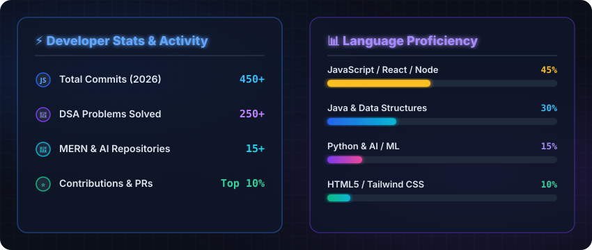

<div align="center">

  <!-- 1. ANIMATED HERO BANNER -->
  

  <br/><br/>

  <!-- 2. ANIMATED TYPING TERMINAL -->
  

  <br/><br/>

  <!-- VISITOR COUNTER & STATUS BADGES -->
  <p align="center">
    
    
    
  </p>

  <br/>

  <!-- SOCIAL BUTTONS -->
  <p align="center">
    <a href="https://linkedin.com" target="_blank">
      
    </a>
    <a href="https://github.com/MAHENDRA-NAIDU" target="_blank">
      
    </a>
    <a href="mailto:mahendra.meesala@example.com" target="_blank">
      
    </a>
    <a href="https://leetcode.com" target="_blank">
      
    </a>
    <a href="https://geeksforgeeks.org" target="_blank">
      
    </a>
    <a href="https://instagram.com" target="_blank">
      
    </a>
  </p>

  <br/>

  

  <br/><br/>

</div>

<!-- ABOUT ME CODE BLOCK & WORKSPACE ILLUSTRATION -->
<table>
  <tr>
    <td width="50%" valign="top">
      <h3 align="left">⚡ About Me</h3>
      
```javascript
const mahendra = {
    pronouns: "He/Him",
    location: "India 🇮🇳",
    education: "B.Tech CSE",
    learning: [
        "MERN Stack",
        "Node.js & Express",
        "React & Redux",
        "MongoDB & MySQL",
        "Data Structures & Algorithms"
    ],
    interests: [
        "Artificial Intelligence",
        "Backend Architecture",
        "Open Source Contribution"
    ],
    goal: "Software Engineer"
};
```
    </td>
    <td width="50%" valign="center" align="center">
      <!-- PROFESSIONAL WORKSPACE ILLUSTRATION -->
      
    </td>
  </tr>
</table>

<br/>

<div align="center">
  
  <br/><br/>

  <!-- TECH STACK & TOOLS -->
  <h2>⚡ Tech Stack &amp; Tools</h2>
  <br/>

  <table width="100%">
    <tr>
      <td align="center" width="20%"><b>Languages</b></td>
      <td align="left">
        
        
        
        
        
      </td>
    </tr>
    <tr>
      <td align="center" width="20%"><b>Frontend</b></td>
      <td align="left">
        
        
        
        
      </td>
    </tr>
    <tr>
      <td align="center" width="20%"><b>Backend</b></td>
      <td align="left">
        
        
        
      </td>
    </tr>
    <tr>
      <td align="center" width="20%"><b>Databases</b></td>
      <td align="left">
        
        
      </td>
    </tr>
    <tr>
      <td align="center" width="20%"><b>Tools &amp; DevOps</b></td>
      <td align="left">
        
        
        
        
        
      </td>
    </tr>
  </table>

  <br/><br/>
  
  <br/><br/>

  <!-- FEATURED PROJECTS SHOWCASE (HIGH-TECH SVG CARD) -->
  <h2>🚀 Featured Projects</h2>
  <br/>

  

  <br/><br/>
  
  <br/><br/>

  <!-- DEVELOPER STATISTICS & METRICS (NATIVE RELIABLE SVG GRAPHIC) -->
  <h2>📊 GitHub Statistics &amp; Metrics</h2>
  <br/>

  

  <br/><br/>

  <!-- SNAKE ANIMATION SECTION -->
  <h2>🐍 Contribution Snake Graph</h2>
  <br/>
  <picture>
    <source media="(prefers-color-scheme: dark)" srcset="https://raw.githubusercontent.com/MAHENDRA-NAIDU/MAHENDRA-NAIDU/output/github-contribution-grid-snake-dark.svg" />
    <source media="(prefers-color-scheme: light)" srcset="https://raw.githubusercontent.com/MAHENDRA-NAIDU/MAHENDRA-NAIDU/output/github-contribution-grid-snake.svg" />
    
  </picture>

  <br/><br/>
  
  <br/><br/>

  <!-- FOOTER -->
  

</div>
